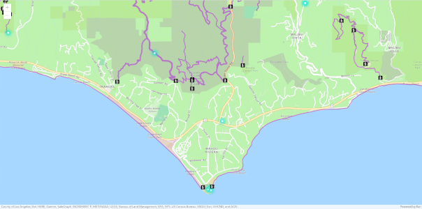

# Basic demo with ArcGIS API for JavaScript

This is the most simple demo to get started with the [ArcGIS API for JavaScript](https://developers.arcgis.com/javascript/). The code is based on several tutorials found on the ArcGIS Developer website, starting with [Display a map](https://developers.arcgis.com/javascript/latest/display-a-map/).

The point of this demo is to show a map with a few data layers and a simple technique to help keep your API key secure by storing it in a separate file that is not committed to version control. The ArcGIS API for JavaScript modules are loaded from CDN with `<script>` tags.

To run this demo:

1. Go to your [developer dashboard](https://developers.arcgis.com/api-keys) and copy your API key.
    - If you do not have an ArcGIS Developer account you can [create on for free](https://developers.arcgis.com/sign-up).
    - You can use the default API key or create a new one. Make sure the basemaps and geocoding scopes are set.
    - [Visit the tutorial](https://developers.arcgis.com/documentation/mapping-apis-and-services/security/tutorials/create-and-manage-an-api-key/) to learn more about API keys.

2. Rename the file `secret.sample.js` to `secret.js` and add your API key by pasting it in the string `"YOUR_API_KEY"`. The map will not render without a valid API key.

```javascript
var YOUR_API_KEY = "YOUR_API_KEY";
```

3. load `index.html` in a web browser. You should not need to install anything else. All of the JavaScript code is in `index.js`.


